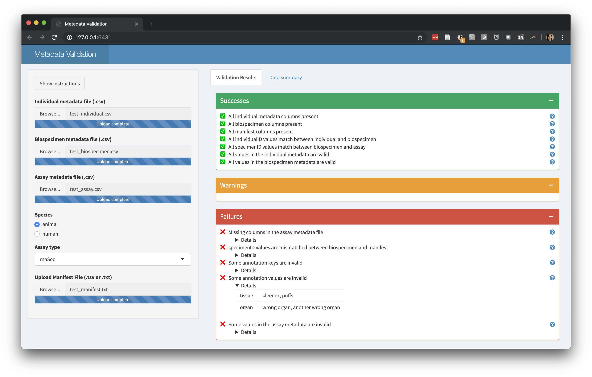

# Data submission validation

This repo contains a Shiny app to validate manifests and metadata for AMP-AD
studies. It uses the
[dccvalidator](https://github.com/Sage-Bionetworks/dccvalidator) package to
check for common data quality issues and gives realtime feedback to the data
contributor on errors that need to be fixed. The reporting UI is heavily inspired by the 
[MetaDIG project's metadata quality reports](https://knb.ecoinformatics.org/quality/s=knb.suite.1/doi%3A10.5063%2FF12V2D1V).

## Deployment

The app is deployed on our shiny pro server through the following steps:

1. ssh into the shiny pro server and navigate to `/home/kwoo/ShinyApps/dccvalidator-app`
1. `git pull` changes from GitHub
1. To ensure packages are up-to-date, run `Rscript -e "renv::restore()"`

You may need to run `touch restart.txt` afterward to ensure the application is restarted.
