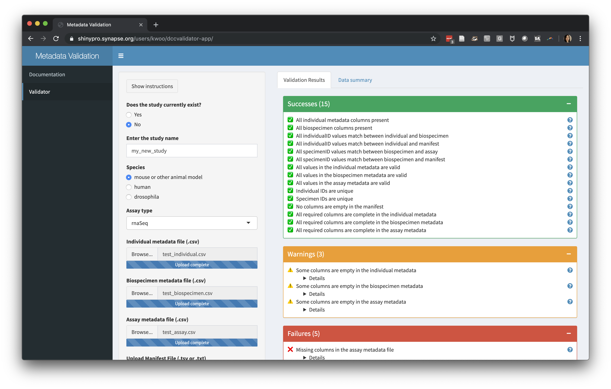
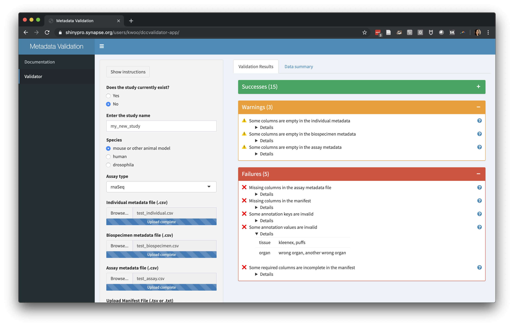

```{r, include = FALSE}
knitr::opts_chunk$set(
  collapse = TRUE,
  comment = "#>"
)
```

# Introduction

We've built the dccvalidator tool to streamline the process of data validation
and QA/QC. As the AMP-AD Knowledge Portal has grown to 50+ studies and over
70,000 data files, we've realized a need to be more standardized in our
approaches to data curation. Thus, we built an application that performs many of
the routine data quality checks we previously conducted by hand, with the hopes
that it will help you, the data contributor, get your data checked, validated,
and shared more easily and quickly.

The application can be found at https://shinypro.synapse.org/users/kwoo/dccvalidator-app/

# Requirements

To use this application you must:

1. Be logged in to Synapse in your browser
2. Be a [Synapse certified user](https://docs.synapse.org/articles/accounts_certified_users_and_profile_validation.html)
3. Be a member of the AMP-AD consortium team

Some portions of the app submit data to Synapse. This allows curators at Sage to
troubleshoot issues if needed; no one outside the Sage curation team will be
able to download the data.

# Instructions

This topic has a general overview of the data contribution process and
detailed instructions for each step, including uploading documentation, metadata
requirements, validating and reviewing the metadata, and uploading the dataset.

## General Process Overview

1. Contact the AMP-AD team to discuss the study and the expected data. Receive
staging folder synIDs for each expected dataset.
2. Upload documentation and validate metadata + manifest files in [dccvalidator](https://shinypro.synapse.org/users/kwoo/dccvalidator-app/).
3. Contact the AMP-AD team when all files pass validation. The team will verify
items not checked by the dccvalidator. Receive permissions to upload data to the
staging folder.
4. Use the validated manifest to upload the data with `syncToSynapse` (see
[Synapse documentation](https://docs.synapse.org/articles/uploading_in_bulk.html) for uploading data in bulk).
5. Contact the AMP-AD team. The team will do the final verifications before
releasing the data.

## Documentation Upload

Each study in AMP-AD has accompanying [documentation in the portal](https://adknowledgeportal.synapse.org/#/Explore/Studies?Study=syn8391648).
You can submit your documentation through the dccvalidator app on the
Documentation page. There should be a study description for the whole study, and
an assay description for each of the assays that was performed. These can be in
a single file, or you can upload multiple files to the assay description
section.


## Data Validation

### Metadata Requirements

Each study should include metadata that would help a new researcher understand
and reuse the data. In most cases, we will expect 4 files:

1. **Individual metadata** a csv file describing each individual in the study.
2. **Biospecimen metadata** a csv file describing the specimens that were collected.
3. **Assay metadata** a csv file describing the assay that was performed. If multiple
   assays were part of the study, there will be one assay file for each.
4. A **manifest** listing each file that will be uploaded. You will use this
   file to upload your data after it has been validated and approved. The manifest
   should be in tsv (tab-delimited text) format.

We provide templates for all of the metadata files within the portal:
https://www.synapse.org/#!Synapse:syn18512044

You can download these files, fill out the first tab, and save it as a .csv or .tsv
file. The other tabs exist to describe the variables and allowed values in the
template. If you do not have any data for some of the columns, you can leave
them blank (but do not remove the column header).

If you don't see a template for the assay(s) in your study, or if not all of the
metadata types above seem relevant to your study, please get in touch with us at
AMPAD_SageAdmin@synapse.org.

### Validating the Metadata and Manifest

The data validation portion of the app allows you to upload metadata files (as
.csv) and the manifest (as .tsv or .txt) and view the results of a series of
automated checks.

Examples of the types of checks we perform are:

- All required columns from the templates are present 
- Individuals and specimens have unique identifiers
- Metadata terms conform to a controlled vocabulary where applicable




### Viewing Data Summary

We also provide a summary of the files you have uploaded, showing the number of
individuals, specimens, and files. We visualize the data in each column by its
data type to help spot unexpected missing values.


## Uploading Data

Once data has passed validation, and the AMP-AD data curators permit edit
permissions to the staging folder for your study, you will use your newly
created manifest file to upload your data and metadata using `syncToSynapse`.
You can execute `syncToSynapse` in the 
[Python client](https://python-docs.synapse.org/build/html/synapseutils.html#synapseutils.sync.syncToSynapse)
or 
[R client](https://github.com/Sage-Bionetworks/synapserutils#upload-data-in-bulk).
For getting started with the Synapse programmatic clients, please visit our
[Synapse docs](https://docs.synapse.org/articles/api_documentation.html).
