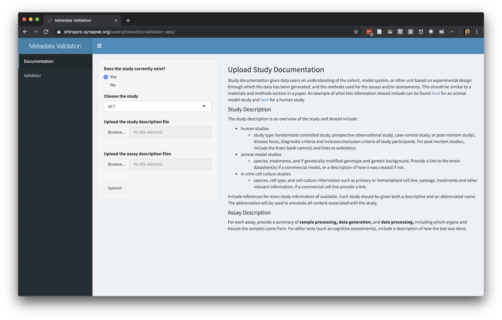
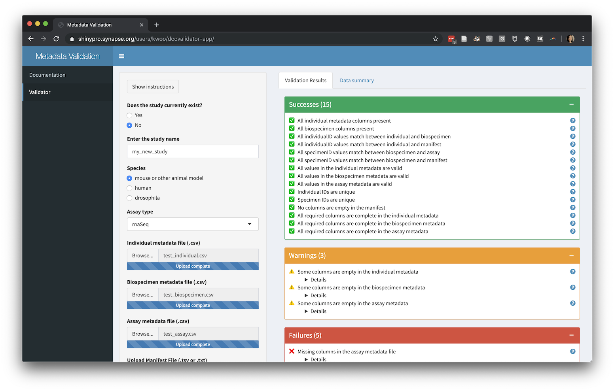
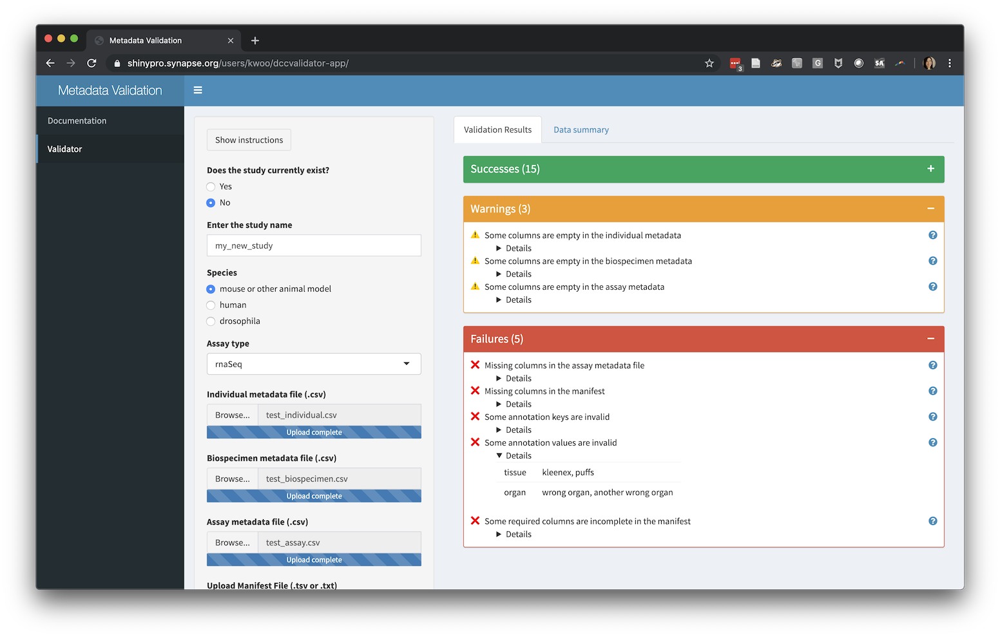
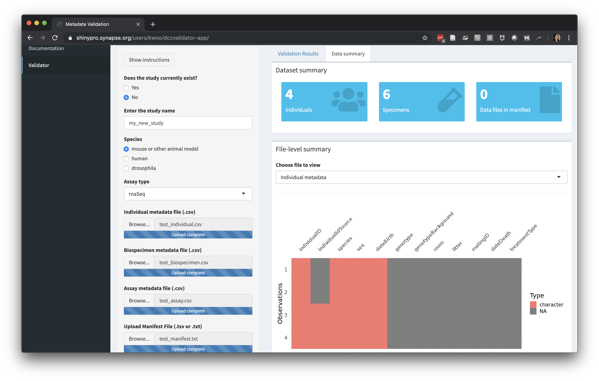

```{r, include = FALSE}
knitr::opts_chunk$set(
  collapse = TRUE,
  comment = "#>"
)
```

# Introduction

We've built the dccvalidator tool to streamline the process of data validation
and QA/QC. As the AMP-AD Knowledge Portal has grown to 50+ studies and over
70,000 data files, we've realized a need to be more standardized in our
approaches to data curation. Thus, we built an application that performs many of
the routine data quality checks we previously conducted by hand, with the hopes
that it will help you, the data contributor, get your data checked, validated,
and shared more easily and quickly.

The application can be found at https://shinypro.synapse.org/users/kwoo/dccvalidator-app/

# Instructions

To use this application you must:

1. Be logged in to Synapse in your browser
2. Be a [Synapse certified user](https://docs.synapse.org/articles/accounts_certified_users_and_profile_validation.html)
3. Be a member of the AMP-AD consortium team

Some portions of the app submit data to Synapse. This allows curators at Sage to
troubleshoot issues if needed; no one outside the Sage curation team will be
able to download the data.

## Documentation upload

### Metadata requirements

Each study should include metadata that would help a new researcher understand
and reuse the data. In most cases, we will expect 4 files:

1. **Individual metadata** describing each individual in the study
2. **Biospecimen metadata** describing the specimens that were collected
3. **Assay metadata** describing the assay that was performed. If multiple
   assays were part of the study, there will be one assay file for each.
4. A **manifest** listing each file that will be uploaded.

We provide templates for all of the metadata files within the portal:
https://www.synapse.org/#!Synapse:syn18512044

If you don't see a template for the assay(s) in your study, please get in touch.

## Data validation

Each study in AMP-AD has accompanying [documentation in the portal](https://adknowledgeportal.synapse.org/#/Explore/Studies?Study=syn8391648).
You can submit your documentation through the dccvalidator app on the
Documentation page. There should be a study description for the whole study, and
an assay description for each of the assays that was performed. These can be in
a single file, or you can upload multiple files to the assay description
section.



### Validating metadata

The data validation portion of the app allows you to upload metadata files (as
.csv) and the manifest (as .tsv or .txt) and view the results of a series of
automated checks.

Examples of the types of checks we perform are:

- All required columns from the templates are present 
- Individuals and specimens have unique identifiers
- Metadata terms conform to a controlled vocabulary where applicable




### Viewing data summary

We also provide a summary of the files you have uploaded, showing the number of
individuals, specimens, and files. We visualize the data in each column by its
data type to help spot unexpected missing values.


